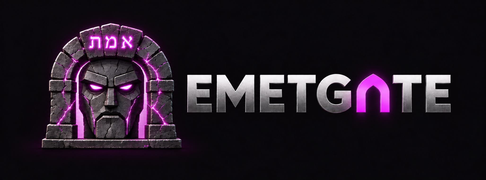
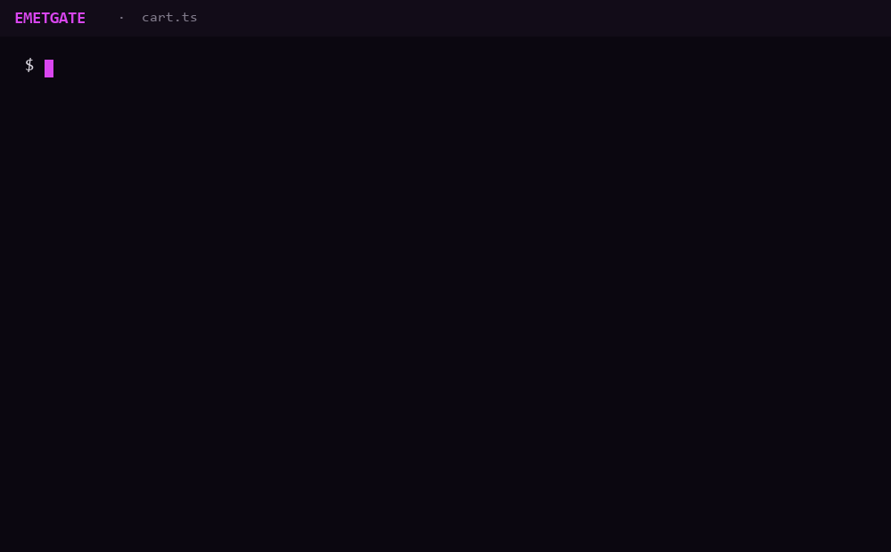

<p align="center">
  
</p>

<p align="center">
  
  
  
  
  
</p>

<p align="center"><b>Nothing passes but the truth.</b><br>
A deterministic verification kernel that sits between a language model and your source tree.</p>

<p align="center">
  
</p>

<p align="center"><sub>A real session, rendered: a placeholder body, an escaped body, a stale hash and a write outside the shadow copy are all refused; a correct body is committed.</sub></p>

---

## The name

In the legend of the Golem of Prague, a rabbi shapes a figure out of river clay. It is strong, tireless and obedient, and it has no judgment of its own. What animates it is a single word written on its forehead: **אמת**, *emet*, "truth". When the golem runs out of control, the rabbi erases the first letter. What remains is **מת**, *met*, "dead", and the golem falls back into clay.

The three letters of *emet* are the first, the middle and the last letter of the Hebrew alphabet. The traditional reading is that truth has to hold from beginning to end; take one piece away and it is no longer truth.

A language model is a golem in the precise sense of the story. It produces a great deal of work, quickly, and it has no way of knowing whether that work is correct. Emetgate is the word on the forehead and the gate in front of the door: the model may propose anything, and only what can be verified is allowed through.

## Why this exists

The failure modes of LLM-generated code are well known to anyone who has used it seriously:

- The code compiles and is still wrong.
- The model reports a task as done when it is not.
- A rule stated three turns ago is silently forgotten.
- A plan agreed at the start of a session has evaporated by the end of it.

These look like separate problems. They share one cause: **nothing between the model and the disk is responsible for checking what the model produced.** The current generation of tools competes on autonomy and speed, which increases the volume of unverified output. The model itself cannot close the gap. It is a sampler, not an oracle; it has no persistent memory, and it cannot verify its own work.

Emetgate takes the opposite position. The model holds no authority at all. A small deterministic kernel holds all of it.

## Core principle

> **The model proposes. The kernel verifies. Nothing unverified reaches the disk.**

- The model can read code, and it can propose a change to a symbol. It cannot write a file, it cannot mark work as finished, and its claims about its own output carry no weight.
- The kernel decides. Every proposal is checked structurally and, where the change is not provably contained, against the project's test command. It is either committed atomically or rejected with a reason.
- The kernel is **fail-closed**. When it cannot prove that a change is safe, the change is refused. Uncertainty is never resolved in favour of the proposal.

This is not a new idea. It is the architecture of LCF-style theorem provers, where tactics may suggest anything but only a small trusted kernel can produce a theorem, and it is what de Bruijn meant when he argued that a proof checker should rest on a core small enough to be trusted by inspection. Emetgate applies the same discipline to code written by a model.

## How a change moves through the gate

```
 model ──propose──▶ ┌──────────────────────────────── kernel ────────────────────────────────┐
                    │                                                                          │
                    │  1. address     symbol + content hash must match what is on disk         │
                    │  2. parse       new body is spliced by byte range and re-parsed          │
                    │  3. guard       no syntax errors, no escape from the body, no            │
                    │                 placeholders, nothing outside the span may change        │
                    │  4. bound       blast radius is computed: BOUNDED or UNBOUNDED           │
                    │  5. test        UNBOUNDED changes run the full test gate in a sandbox    │
                    │  6. commit      journaled, atomic write-rename, or reject with a reason  │
                    │                                                                          │
                    └──────────────────────────────────────────────────────────────────────────┘
                                          │                          │
                                     committed                   rejected
```

**Content addressing.** Every symbol is identified by a reference (`Class.method`, `add`) and a 128-bit hash of its current content. A proposal must name the hash it was based on. If the file changed in the meantime, the hash no longer matches and the proposal is rejected. The model cannot overwrite code it has not seen.

**AST-verified mutation.** A change replaces exactly one function body. The new body is spliced into the source by byte range and the whole file is re-parsed with tree-sitter. The kernel then checks that the result parses cleanly, that the body did not break out of its braces, that it is not an empty or placeholder body, and that every byte outside the target span is untouched.

**Boundedness.** Before running anything, the kernel computes whether the change can affect code beyond the symbol itself. The analysis is a positive, closed-world count: a change is `BOUNDED` only when every way it could escape has been ruled out, and the verdict carries its provenance. Anything the analysis cannot account for is `UNBOUNDED`.

**Test gate.** `UNBOUNDED` changes are applied to a shadow copy and the project's test command is run against it inside a sandbox (a Windows Job Object with kill-on-close, wall-clock and memory limits, and an output cap). The command runs under a low-integrity restricted token, so a body proposed by the model cannot write anywhere outside the shadow copy; if that token cannot be built and verified, the command is refused rather than run unconfined. If the tests fail, the change is rejected and the output is returned to the model.

**Durable commit.** Accepted changes go through a write-ahead journal and an atomic write-rename. A crash at any point leaves either the old file or the new one, never a torn write. `recover` replays the journal and refuses anything it cannot prove: zero-byte files, entries that no longer re-parse, and malformed tags.

## Architecture

```
src/
├── engine/      pure and deterministic, no I/O
│   ├── tree_sitter, loader, traversal, skeleton
│   ├── symbol, ref, functions        symbol table, references, content hashes
│   ├── cas                           AST-verified mutation and structural guards
│   └── boundedness                   closed-world blast-radius analysis
├── platform/    everything that touches the machine
│   ├── disk                          journal, atomic write, recovery
│   ├── sandbox                       Job Object isolation and resource limits
│   ├── shadow, repo, lockdown        shadow workspace, repo lock, locked-down launch
│   ├── runner, gate, batch           cas → boundedness → test gate
│   └── memory                        append-only decision ledger
└── protocol/    the MCP surface
    ├── server, handlers, wire        tools and typed results
    ├── policy, telemetry             repo-config trust, event log
    └── read_tools, diagnostics       scoped reads, tsc diagnostics
```

The dependency direction is strict: `protocol → platform → engine`. The engine cannot import the platform. Everything that decides whether a change is valid is a pure function of its inputs, which is what makes it testable to the standard described below.

### MCP tools

| Tool | Purpose |
|---|---|
| `emetgate_symbols` | Symbols in a file, with references, positions and content hashes |
| `emetgate_skeleton` | Signatures and structure without bodies |
| `emetgate_read_symbol` | The source of one symbol |
| `emetgate_mutate` | Verify a proposed body structurally and return the result without writing |
| `emetgate_try` | Verify, gate and commit a proposed body |
| `emetgate_try_batch` | Several proposals as one unit |
| `emetgate_read_file`, `emetgate_list`, `emetgate_search` | Reads confined to the repository |
| `emetgate_scan` | Measure one check expression against the repository, optionally within a `where` scope; writes nothing |

`emetgate lockdown` starts Claude Code with only these tools available, so the model has no path to the disk other than the gate.

## How the kernel itself is verified

A verification layer that has not been verified is only a more elaborate way of hoping. Two rules apply to every guard in the kernel.

**Mutation kill.** Guards and branches that protect an invariant are mutated (a check removed, a condition weakened, a comparison flipped) and the test suite is run against each mutant. At least one test must fail. A surviving mutant is either killed by a new test or recorded in `tests/mutations.json` with the reason it cannot be: an equivalent mutant, with the grammar or code fact that makes it one, or a redundant guard kept on purpose. Mutants with no killing input and no proof of equivalence are marked open rather than hidden. The harness lives in `tools/mutate`.

For the engine (`cas`, `boundedness`, `symbol`, `functions`) that is 44 mutants today: 37 killed, 4 proven equivalent, 1 redundant guard kept as defense in depth, 2 open.

**Adversarial tests.** Dedicated red-team suites attack the gate directly: bodies that escape their braces, stale hashes, torn journal entries, poisoned repository configuration and attempts to open files outside the repository.

## Status

Emetgate is early and deliberately narrow.

| Area | State |
|---|---|
| AST-verified mutation, content hashes, structural guards | Built, mutation-tested |
| Boundedness analysis and test gate | Built, mutation-tested |
| Journal, atomic commit, recovery, sandbox | Built |
| MCP server and locked-down launch | Built |
| Decision ledger (append-only, supersession, compaction, torn-tail recovery) | Built, not yet exposed as MCP tools |
| Rule enforcement at the edit gate | In progress |
| Language support | TypeScript and JavaScript (`.js`, `.mjs`, `.cjs`); new languages are added as profiles under `src/engine/lang` and must pass the conformance suite in `tests/lang` |
| Platform | Windows only (the sandbox relies on Job Objects) |

On the token benchmark in `tests/bench` (tokenizer `o200k_base`, six scenarios, two of them real files), editing through symbol-level proposals uses a median of **1.80×** fewer tokens than search-and-replace editing, with a range of 1.15× to 3.77×. On the real files the gain is modest, 1.15× to 1.17×. Token savings are a side effect, not the point.

Each scenario counts the tokens both approaches actually spend on one symbol edit: ingest plus emit. Search-and-replace reads the whole file and sends the old and new block; the kernel reads a skeleton plus one symbol body and sends a symbol reference, a content hash and the new body. Search-and-replace is the baseline; a whole-file rewrite is the upper bound (2.88× on the same set). The tokenizer is a GPT-4o-family proxy, so the ratio is the signal, not the absolute count. It is deterministic and offline — build the binary and run `python tests/bench/run4.py` to reproduce every number here.

## Limits

Some things cannot be made mechanical, and this project does not claim otherwise.

- **Semantic correctness.** Code that parses, stays in bounds and passes the tests can still implement the wrong behaviour. The kernel raises the floor; it does not replace tests that encode intent, or a human decision where one is needed.
- **The quality of the test suite.** For unbounded changes the test gate is only as strong as the tests it runs.
- **Mediation.** The guarantees hold for changes that go through the gate. Edits made by other tools bypass it, which is why lockdown exists.
- **Sandbox scope.** The low-integrity token stops the test command from writing outside the shadow copy; it does not restrict reading or network access, so a hostile test command can still read files it has permission to read and reach the network. Confining those requires an AppContainer, which is planned.
- **Taste.** Architecture, API design and user experience are not properties a kernel can check.

## Installing

Each release tag publishes a Windows binary and its SHA-256 checksum on the [releases page](https://github.com/emetgate/emetgate/releases). Download both into a fixed folder under your profile (this only downloads; nothing is run):

```powershell
New-Item -ItemType Directory -Force "$env:USERPROFILE\emetgate" | Out-Null
foreach ($f in "emetgate.exe", "emetgate.exe.sha256") { Invoke-WebRequest "https://github.com/emetgate/emetgate/releases/latest/download/$f" -OutFile "$env:USERPROFILE\emetgate\$f" }
```

Check the binary against the published checksum before running it; this prints `True` when they match:

```powershell
(Get-FileHash "$env:USERPROFILE\emetgate\emetgate.exe" -Algorithm SHA256).Hash -eq (Get-Content "$env:USERPROFILE\emetgate\emetgate.exe.sha256").Split(" ")[0]
```

Register it with Claude Code by its absolute path, because Claude Code runs the stored command as written and a relative path does not resolve when Claude Code is started from another directory:

```powershell
claude mcp add emetgate -- "$env:USERPROFILE\emetgate\emetgate.exe" mcp
```

The binary is not code-signed, so Windows SmartScreen warns on first run: it flags executables that carry no publisher signature and have little download history, not because it found anything in this one. The checksum above is how to confirm the file is the one the release built.

## Building

Requires Zig 0.16.0. tree-sitter and the TypeScript grammar are vendored.

```sh
zig build                 # zig-out/bin/emetgate
zig build test            # unit and end-to-end tests
zig build mutate-tool     # mutation harness
```

Register the server with an MCP client:

```json
{
  "mcpServers": {
    "emetgate": {
      "command": "C:/path/to/zig-out/bin/emetgate.exe",
      "args": ["mcp", "--typecheck", "npx tsc --noEmit", "--test", "npm test"]
    }
  }
}
```

`--typecheck` is optional. When it is set, the typecheck command runs on the shadow copy before the test command, and a failure rejects the change with reason `typecheck_failed` without running the tests. Both commands can instead come from `test_cmd` and `typecheck_cmd` in `.emetgaterc.json`, which is read only with `--allow-repo-config`. The model can never supply either command.

## Roadmap

1. **Decision memory.** Rules and decisions stated once are written to the ledger, re-injected into the model's input on every relevant turn, and, where a rule can be checked mechanically, enforced at the edit gate. A decision changes only when the user changes it.
2. **Codebase understanding.** A content-addressed, incremental index of symbols, imports and git history, so the model is given the minimal slice of the program a task touches instead of the whole repository.
3. **Deterministic driver.** For tasks with a known shape, the kernel drives the work and calls the model only at the points that genuinely require judgment.
4. **Check packs.** Domain-specific mechanical checks for backend and frontend code, registered with the same gate.

Each step is held to the same rules as the kernel: fail-closed, mutation-killed, content-addressed, and described in numbers rather than adjectives.

## License

MIT. See [LICENSE](LICENSE). The vendored tree-sitter grammars under `vendor/` keep their own MIT licenses.
