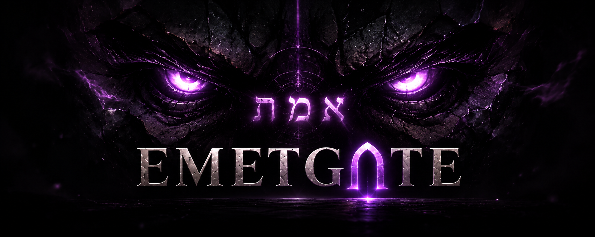
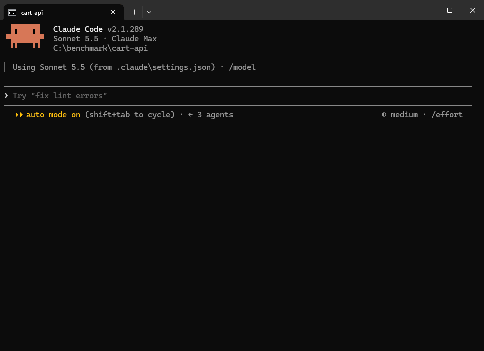

<p align="center">
  
</p>

<p align="center">
  
  
  
</p>

# Emetgate

A verification gate between a coding model and your source tree. The model proposes a change; Emetgate checks it and writes it only if the checks pass.

<p align="center">
  
</p>

It runs as an MCP server. `emetgate lockdown` starts Claude Code with only Emetgate's tools, so every write goes through the gate.

## How a write is checked

1. **Address.** A change names a symbol and the hash of the content it was based on. If the file changed since, the hash does not match and the change is refused.
2. **Splice and reparse.** The new body replaces exactly the old one by byte range. The file is reparsed with tree-sitter. Syntax errors, a body that escapes its braces, placeholder bodies and any change outside the span are refused.
3. **Proof, where there is one.** Renames are checked with a name-abstracted (alpha) hash and a scope resolver that cross-checks the TypeScript language service. Moves keep the moved code's hash and derive every import. New and deleted symbols must be unreferenced.
4. **Rules.** Rules you add from the CLI run here: built-in checks, tree-sitter queries (`q:`) or your own linter (`cmd:`).
5. **Tests in a sandbox.** The change is applied to a shadow copy outside the repository. Your typecheck and test commands run there under a low-integrity token in a Job Object with time, memory and output limits.
6. **Atomic commit.** One write-ahead journal per batch, atomic replace, directory flushes. After a crash, `emetgate recover` leaves a batch all old or all new.
7. **Receipt.** Every commit gets a receipt: hashes before and after, the evidence used, the tests run, the rules applied.

If a check cannot finish, the change is refused. The model cannot change the test command, the rules or the sandbox settings.

## Tools

| Tool | What it does |
|---|---|
| `emetgate_symbols`, `emetgate_skeleton` | Symbols and signatures with content hashes |
| `emetgate_read_symbol` | One or more symbol bodies, or a line range widened to whole symbols |
| `emetgate_read_file` | JSON key tree or one pointer, Markdown headings or one section, text line range |
| `emetgate_list`, `emetgate_search` | Files and text search inside the repository |
| `emetgate_git` | Read-only `status`, `diff`, `log`, `show` |
| `emetgate_mutate` | Check a proposed body without writing it |
| `emetgate_try`, `emetgate_try_batch` | Replace, create or delete symbols and files, one change or an atomic batch |
| `emetgate_write_doc` | JSON pointer, Markdown section or text range write, alone or in a batch with code |
| `emetgate_rename` | Rename a function, class, variable, type or enum everywhere it is used |
| `emetgate_move` | Move a declaration to another file; imports are derived by the kernel |
| `emetgate_move_file` | Move or rename a file and rewrite every import to and from it |
| `emetgate_run` | Run a command you allowed with `--allow-run`, in the shadow copy |
| `emetgate_scan` | Measure one rule against the repository |

Reads repeat nothing within a session when `--mirror` is on: an unchanged symbol comes back as one line with its hash.

## Rules

```
emetgate rule add "no console.log" --check "cmd:npx eslint --rule no-console" --in src/ --enforce
emetgate rule add "no networkidle waits" --check forbid:networkidle --enforce
emetgate rule list
```

An `--enforce` rule refuses a change that breaks it before the tests run. Rules are written only from the CLI. The model can read them and cannot change or remove them.

## Receipts

```
emetgate receipts attach            # attach pending receipts to your last commit as git notes
emetgate verify HEAD --test "npm test"
```

A receipt is an in-toto statement in canonical JSON (RFC 8785). `emetgate verify` checks a commit without trusting the process that wrote it: it recomputes hashes and alpha hashes and reruns the tests in the sandbox. A change with no receipt, or a file edited after the gate, is reported `unverified`, never green.

The checker imports no code that writes. It trusts <!-- generated:verifier-tcb -->2,502 non-blank lines of Zig in 22 files, 727 of them in the 3 files of `src/verify/`<!-- /generated -->, plus tree-sitter and the Zig standard library. A second checker in Python, written from the receipt format alone (<!-- generated:python-checker-size -->383 non-blank lines of Python, plus 298 in the vendored BLAKE3<!-- /generated -->), runs on every verify test and must agree with the first.

## Measured

Tokens for common reads, against Claude Code's `Read` (o200k_base, `python tests/bench/reader.py`, 2026-09-26):

| Task | Read | Emetgate |
|---|---:|---:|
| Find and read one function in a 1.6k-line file | 13,313 | 2,819 |
| Read one key in a 50 KB `package-lock.json` | 19,859 | 319 |
| Read one section of a README | 15,432 | 1,541 |
| Read the same symbol again in a session | 13,313 | 84 |
| Reread a 3-line symbol after it changed | 18 | 74 |

The last row is worse: the reply carries the hash the next edit needs. Rule and query cost measurements are in [REFERENCE.md](REFERENCE.md).

## How the gate itself is tested

- **Mutation testing.** Guards are mutated and at least one test must fail for each. For the engine: <!-- generated:engine-mutant-summary -->64 mutants today: 57 killed, 4 proven equivalent, 2 redundant guards kept as defense in depth, 1 open<!-- /generated -->. Every recorded mutant and the test that kills it: [VERIFICATION.md](VERIFICATION.md).
- **Model checking.** The commit journal is specified in TLA+ and checked with TLC for two and three files, including crashes during recovery and lost directory entries.
- **Crash tests.** Batches are cut after every step and recovered.
- **Red-team and fuzz suites** against the MCP surface, the sandbox, the journal and the parsers.

Numbers above in generated blocks are produced from the source and checked in CI.

## Install

Each release publishes `emetgate.exe` and its SHA-256 on the [releases page](https://github.com/emetgate/emetgate/releases).

```powershell
New-Item -ItemType Directory -Force "$env:USERPROFILE\emetgate" | Out-Null
foreach ($f in "emetgate.exe", "emetgate.exe.sha256") { Invoke-WebRequest "https://github.com/emetgate/emetgate/releases/latest/download/$f" -OutFile "$env:USERPROFILE\emetgate\$f" }
(Get-FileHash "$env:USERPROFILE\emetgate\emetgate.exe" -Algorithm SHA256).Hash -eq (Get-Content "$env:USERPROFILE\emetgate\emetgate.exe.sha256").Split(" ")[0]
claude mcp add emetgate -- "$env:USERPROFILE\emetgate\emetgate.exe" mcp --test "npm test"
```

The binary is not code-signed, so SmartScreen warns on first run. Compare the checksum instead.

## Build

Zig 0.16.0. tree-sitter and the grammars are vendored.

```sh
zig build                  # zig-out/bin/emetgate
zig build test             # all tests
tools/accept.ps1 <ref>     # tests three times, then the mutants on lines changed since <ref>
```

## Security history

Findings against the gate. Details in [REFERENCE.md](REFERENCE.md#security-history).

**F1: the write tools were not confined to the served repository.** Fixed in v0.1.2.

**F2: `.git` inside a git worktree was refused for the wrong reason.** Low severity; fixed.

**F3: a rejected proposal could write to the real repository while its tests ran.** Fixed with the low-integrity token in v0.1.2.

**Repository ledger: `cmd:` rules from a committed ledger ran without consent.** Fixed in PR #31.

**F4: a crash during a batch could leave it half applied.** Found with TLA+; fixed with a batch commit record.

**F5: the test command could not see `node_modules` through a junction.** Functional fault; fixed with hardlink trees.

**F6: a crash while replacing a file could leave its path empty.** Found with TLA+; fixed with copy-then-replace.

**F7: a power cut could leave a batch half applied.** Found with TLA+; fixed by flushing four directory changes.

## Limits

- Windows only; the sandbox uses Job Objects and integrity levels. TypeScript, JavaScript and Zig only.
- Passing the gate means the code parses, stays in bounds and passes your tests. It does not mean the code is correct.
- The test gate is as strong as your tests.
- The sandbox blocks writes outside the shadow copy. It does not block reads or network access. An AppContainer backend exists but is not used, because real projects do not run under it yet.
- Changes made outside the gate are not covered. That is what lockdown is for.
- Node.js 24.15.0 and earlier crash intermittently on Windows loopback connections; use 24.16.0 or later.

## License

MIT. The vendored grammars under `vendor/` keep their own MIT licenses.
