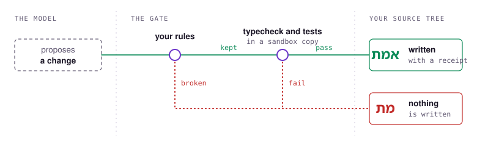
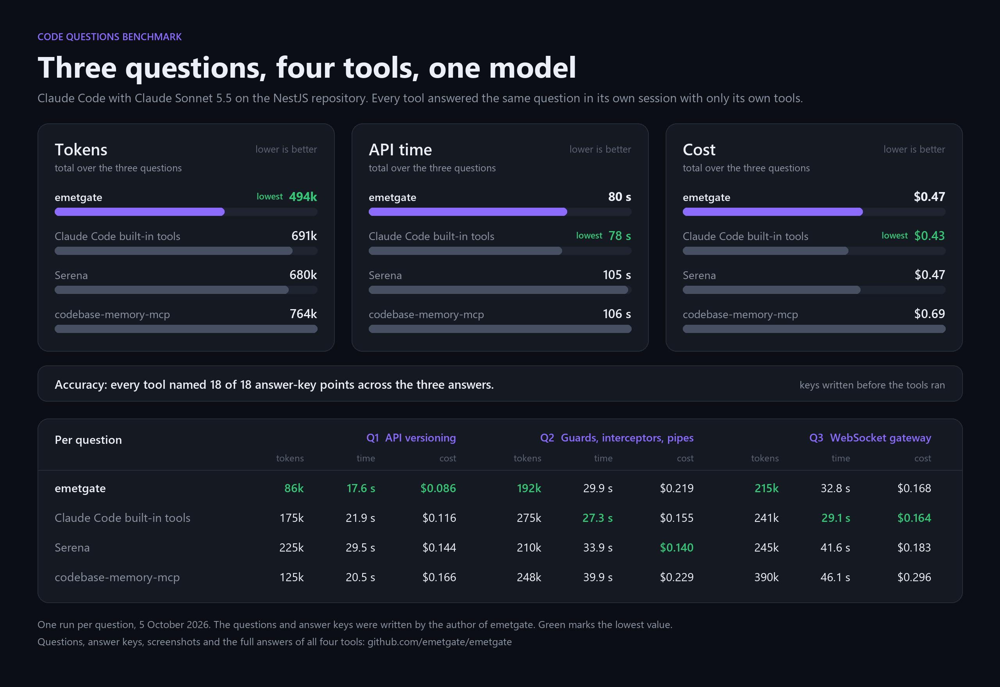
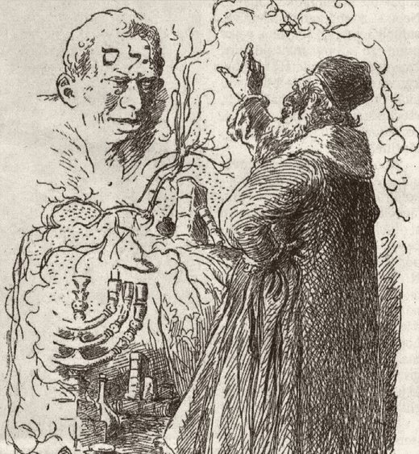

<p align="center">
  
</p>

<p align="center">
  
  
  
  <a href="https://github.com/emetgate/emetgate/actions/workflows/ci.yml"></a>
  <a href="https://github.com/emetgate/emetgate/releases/latest"></a>
</p>

<p align="center"><a href="../README.md">English</a> · <a href="README.tr.md">Türkçe</a> · <b>한국어</b> · <a href="README.zh-CN.md">简体中文</a> · <a href="README.es.md">Español</a></p>

# Emetgate

코딩 모델과 소스 트리 사이에 놓이는 게이트입니다. 모델이 변경을 제안하면 Emetgate가 검사하고, 검사를 통과한 변경만 디스크에 기록됩니다.

Claude Code용 MCP 서버로 실행되며, Windows에서 TypeScript와 JavaScript 프로젝트를 지원합니다.

https://github.com/user-attachments/assets/20d0c586-9943-4bc0-80ec-abdd8d2039e0

## 하는 일

**모든 쓰기를 검사합니다.** 변경은 심볼과, 그 변경이 기반으로 삼은 코드의 해시를 지정합니다. Emetgate는 새 본문을 제자리에 넣고, 파일을 다시 파싱하고, 규칙을 실행한 다음, 샌드박스 안의 저장소 복사본에서 타입 검사와 테스트를 실행합니다. 어느 단계든 실패하면 아무것도 기록되지 않습니다. 커밋마다 영수증이 남으며, `emetgate verify`는 그것을 기록한 프로세스를 신뢰하지 않고도 나중에 다시 검사할 수 있습니다.

**모델을 위해 코드를 읽습니다.** `emetgate_explore`는 코드베이스에 대한 질문에 전체 정의와 줄 번호로 답합니다. `emetgate_evidence`는 이름을 지정한 심볼의 전체 코드를 반환합니다. 심볼, 파일, 검색, git을 위한 도구도 있으며 목록은 [REFERENCE.md](../REFERENCE.md#mcp-tools)에 있습니다.

**규칙을 지킵니다.** 규칙은 명령줄에서 한 번 추가합니다. 모델은 규칙을 읽을 수 있지만 바꾸거나 제거할 수 없습니다.

```
emetgate rule add "no console.log" --check "cmd:npx eslint --rule no-console" --in src/ --enforce
emetgate rule add "no networkidle waits" --check forbid:networkidle --enforce
```

<p align="center">
  <picture>
    <source media="(prefers-color-scheme: dark)" srcset="../assets/gate-dark.svg">
    
  </picture>
</p>

## 설치

각 릴리스는 `emetgate.exe`와 그 SHA-256을 [릴리스 페이지](https://github.com/emetgate/emetgate/releases)에 게시합니다.

```powershell
New-Item -ItemType Directory -Force "$env:USERPROFILE\emetgate" | Out-Null
foreach ($f in "emetgate.exe", "emetgate.exe.sha256") { Invoke-WebRequest "https://github.com/emetgate/emetgate/releases/latest/download/$f" -OutFile "$env:USERPROFILE\emetgate\$f" }
(Get-FileHash "$env:USERPROFILE\emetgate\emetgate.exe" -Algorithm SHA256).Hash -eq (Get-Content "$env:USERPROFILE\emetgate\emetgate.exe.sha256").Split(" ")[0]
claude mcp add emetgate -- "$env:USERPROFILE\emetgate\emetgate.exe" mcp --test "npm test"
```

바이너리는 코드 서명이 되어 있지 않아 첫 실행 때 SmartScreen이 경고합니다. 대신 체크섬을 비교하십시오.

`emetgate lockdown`은 Emetgate의 도구만으로 Claude Code를 시작하므로 모든 쓰기가 게이트를 거칩니다.

lockdown 상태에서는 프롬프트에 규칙을 직접 입력할 수도 있습니다. Emetgate가 응답하며 그 줄은 모델에 전달되지 않습니다:

```
/rule add "no comments in source" --check no_comment --enforce
/rule list
```

이후 모든 쓰기는 대화 기록에 표시됩니다. 게이트가 통과시키면 초록색 **אמת**, 거부하면 빨간색 **מת**입니다.

## 측정 결과

네 개의 저장소에 대한 질문 15개를 Emetgate, Serena, codebase-memory-mcp, Claude Code 자체 도구로 물었습니다. 같은 모델(`claude-sonnet-5-5`), 실행마다 저장소의 새 복사본, 추가 프롬프트 없음, 질문당 세 번 실행입니다. 점수는 정답 키의 항목 가운데 답변이 이름을 언급한 비율이며, 정답 키는 어떤 도구도 실행하기 전에 제가 작성했습니다.

| 도구 | 점수 | 토큰 | 비용 |
|---|---:|---:|---:|
| Emetgate | 240/252 | 86.7k | $0.132 |
| Serena | 242/252 | 143.8k | $0.143 |
| Claude Code 자체 도구 | 234/252 | 171.4k | $0.150 |
| codebase-memory-mcp | 246/252 | 178.5k | $0.204 |

이 세트에서 Emetgate는 토큰을 가장 적게 쓰고 비용도 가장 낮습니다. 가장 정확하지는 않습니다. 두 도구의 점수가 더 높습니다. 252점 가운데 두 점 차이는 실행마다 달라지는 폭 안에 있으므로, 이 실행들로는 도구의 점수 순위를 매길 수 없습니다.

또한 네 도구에 질문 세 개를 직접 더 입력했고, 각각 한 번씩 실행했습니다. Emetgate는 이번에도 토큰을 가장 적게 썼고, Claude Code 자체 도구가 더 저렴하고 더 빨랐습니다:

<p align="center">
  
</p>

기록된 345개 세션이 비용에 대해 보여 준 것:

- 한 세션의 비용은 네 가지 토큰 수로 정해지며, 캐시에 쓰는 토큰 하나는 캐시에서 읽는 토큰 하나의 20배입니다. 토큰이 적다고 해서 항상 청구액이 낮은 것은 아닙니다.
- 모델 호출이 한 번 늘어나는 비용은 도구 출력 약 8,000자와 비슷합니다.
- 모델은 자신이 요청한 것을 씁니다. 자신의 도구 호출에서 이름을 지정한 항목은 98.5%가 답변에 들어갔고, 응답에서 보기만 한 항목은 90.5%였습니다.

세션, 질문, 정답 키와 이 숫자들을 만들어 내는 스크립트는 [tests/bench/neutral](../tests/bench/neutral)에 있습니다. 전체 답변이 포함된 직접 테스트는 [tests/bench/hand](../tests/bench/hand)에 있습니다. 개별 읽기, 편집, 검색의 토큰 수는 [REFERENCE.md](../REFERENCE.md)에 있습니다.

## 게이트는 어떻게 테스트되는가

- **변이 테스트.** 각 가드를 일부러 망가뜨리고, 적어도 하나의 테스트가 실패해야 합니다. 엔진에는 현재 변이체 64개가 있습니다: 57개 제거됨, 4개는 동등함이 증명됨, 2개는 심층 방어로 유지하는 중복 가드, 1개 미해결. 목록은 [VERIFICATION.md](../VERIFICATION.md)에 있습니다.
- **모델 검사.** 커밋 저널은 TLA+로 명세되어 있으며, 복구 중의 크래시를 포함해 TLC로 검사했습니다.
- **크래시 테스트.** 배치를 모든 단계 뒤에서 끊고 복구합니다.
- **레드팀 및 퍼즈 스위트**: MCP 표면, 샌드박스, 저널, 파서를 대상으로 합니다.

게이트에 대해 발견된 문제와 수정 내용은 [REFERENCE.md](../REFERENCE.md#security-history)에 정리되어 있습니다.

## 한계

- Windows 전용입니다. TypeScript, JavaScript, Zig만 지원합니다.
- 게이트를 통과했다는 것은 코드가 파싱되고, 범위 안에 머물며, 테스트를 통과한다는 뜻입니다. 코드가 올바르다는 뜻은 아니며, 테스트 게이트는 여러분의 테스트만큼만 강합니다.
- 샌드박스는 복사본 밖으로의 쓰기를 막습니다. 읽기나 네트워크 접근은 막지 않습니다.
- 게이트 밖에서 이루어진 변경은 다루지 않습니다. lockdown은 그것을 위한 것입니다.
- Node.js 24.15.0 및 그 이전 버전은 Windows 루프백 연결에서 간헐적으로 크래시가 발생합니다. 24.16.0 이상을 사용하십시오.

## 이름의 유래

<picture>
  <source media="(prefers-color-scheme: dark)" srcset="../assets/golem-ales-dark.jpg">
  
</picture>

프라하의 골렘 전설에서 랍비 뢰브는 진흙으로 빚은 형상의 이마에 **אמת** (*에메트*, 진실)를 쓰고, 형상은 살아납니다. 첫 글자를 지우면 **מת** (*메트*, 죽음)가 남고 골렘은 멈춥니다.

Emetgate는 모든 쓰기를 같은 단어로 표시합니다. 게이트가 통과시키면 온전한 단어로, 거부하면 첫 글자가 지워진 단어로 표시합니다.

<sub>Mikoláš Aleš, <i>Rabbi Loew and the Golem</i>, 1899. Public domain.</sub>

<br clear="left">

## 빌드

Zig 0.16.0. tree-sitter와 문법은 저장소에 포함되어 있습니다.

```sh
zig build                  # zig-out/bin/emetgate
zig build test             # all tests
tools/accept.ps1 <ref>     # tests three times, then the mutants on lines changed since <ref>
```

## 라이선스

MIT. `vendor/` 아래에 포함된 문법은 각자의 MIT 라이선스를 유지합니다.

<p align="center"><a href="../README.md">English</a> · <a href="README.tr.md">Türkçe</a> · <b>한국어</b> · <a href="README.zh-CN.md">简体中文</a> · <a href="README.es.md">Español</a></p>
